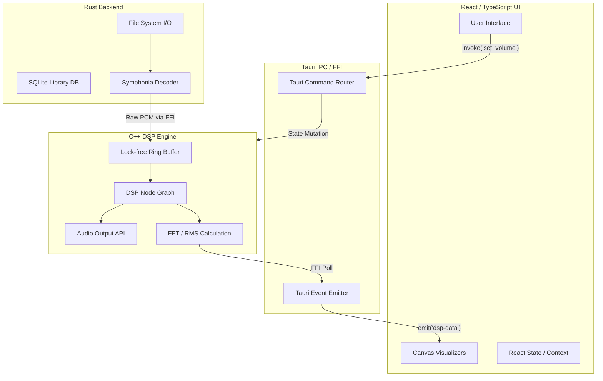
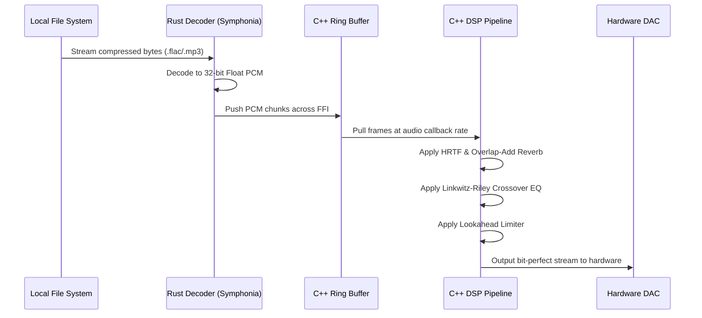

# DmeX: High-Fidelity Bare-Metal Audio Engine

## 1. Introduction & Philosophy

**What is DmeX:** DmeX is a bare-metal media engine built for high-fidelity audio reproduction. It eschews standard web and OS constraints by utilizing a custom C++ Digital Signal Processing (DSP) core, a memory-safe Rust backend, and a high-performance React/Tauri frontend.

**Why DmeX:** Standard Operating System audio mixers (like Windows WASAPI Shared Mode or Android's AudioFlinger) are notorious for degrading audio quality. They silently force sample rate conversions (introducing aliasing artifacts) and apply hidden limiters to prevent system-wide clipping. For audiophiles, this means the audio stream is mathematically altered before it ever reaches the DAC. DmeX bypasses these software mixers, locking directly to the hardware buffer to deliver a bit-perfect, 32-bit floating-point audio stream directly to the digital-to-analog converter.

**Why it's different:** Modern desktop media players built on Electron or Tauri typically rely on the Chromium `<audio>` tag or the WebAudio API. These APIs are heavily sandboxed and subject to browser-level mixing constraints. DmeX completely bypasses the browser's audio pipeline. Instead, the UI simply acts as a remote control for a dedicated C++ audio thread operating at the lowest possible system latency, ensuring that no browser thread-locking or garbage collection pauses can interrupt the DSP stream.

---

## 2. The Core Architecture (C++, Rust, and FFI)

[Image: A high-level technical diagram showing the bridge between the React frontend, the Rust Tauri backend, and the C++ DSP Core, highlighting the flow of IPC and FFI.]

**The Language Bridge:** 

The core engine relies on a strict Foreign Function Interface (FFI) boundary. Rust handles the memory-safe aspects of the application: reading files from disk and utilizing decoders (like Symphonia) to unpack FLAC, MP3, and WAV files into raw PCM data. Rust then pushes these PCM frames across the FFI boundary using `extern "C"` bindings into the C++ engine's lock-free ring buffers. The C++ engine, completely isolated from Rust's memory management, handles the raw, mathematically intensive DSP floating-point operations.

**Command Routing:** 

When a user adjusts the EQ or volume in the React frontend, the UI fires an asynchronous Inter-Process Communication (IPC) command via Tauri (e.g., `invoke("set_master_gain", { gain: 0.8 })`). Rust receives this payload, serializes it, and safely injects the parameter change into the C++ engine's state using atomic variables or a lock-free command queue, ensuring the audio thread is never blocked by UI events.

**Telemetry & Bass Broadcasting:** 

To drive the 60fps visualizations without touching the audio pipeline, DmeX employs a cross-language telemetry pipeline. At the end of every C++ processing block, the engine calculates the RMS (Root Mean Square), crest factor, and specific frequency band amplitudes (using FFT). This telemetry struct is polled by Rust via FFI and broadcasted back to the React UI as a Tauri event. The frontend receives these physical audio measurements and uses them to drive Canvas animations (e.g., bass ripples) mathematically perfectly synced to the audio output.

---

## 3. The Bare-Metal DSP Engine

**HRTF Tech (Head-Related Transfer Functions):** 

To collapse the "in-head" localization typical of headphone listening, DmeX implements HRTF processing. The code utilizes specific time delays (Interaural Time Difference) and frequency shading (Interaural Level Difference) based on human head measurements. By applying a pinna notch filter (a slight attenuation around 8kHz), the algorithm tricks the brain's localization mechanisms into perceiving the sound source as existing in the physical room outside the listener's skull.

**Convolutional Reverbs & FFT:** 

Applying high-quality room impulse responses (IR) using direct time-domain convolution is an `O(N^2)` mathematical operation that causes severe CPU thermal throttling on mobile devices. DmeX solves this by utilizing Fast Fourier Transforms (FFT). The engine transforms the incoming audio chunk into the frequency domain, mathematically multiplies it by the pre-transformed impulse response, and runs an Inverse FFT (IFFT) to return to the time domain. This Overlap-Add convolution reduces the algorithmic complexity to `O(N log N)`, keeping the CPU cool while delivering vast 3D acoustic spaces.

**Advanced Tuning (Zero Phase-Distortion):** 

DmeX utilizes a parallel DSP architecture built on Linkwitz-Riley crossover filters. When splitting the audio stream into sub-bass, mid, and treble bands for individual processing, standard filters introduce severe phase distortion at the crossover frequencies. Linkwitz-Riley filters ensure that when the parallel bands are summed back together, the signal remains perfectly in phase, preserving the sharp transients of drum hits and vocal clarity.

**Sub-Bass & Directional Focus:** 

Mobile and laptop speakers physically cannot produce 30Hz sub-bass frequencies. DmeX utilizes the psychoacoustic phenomenon of the "missing fundamental." The DSP algorithm passes the sub-bass frequencies through a nonlinear harmonic wave-shaper that generates targeted 2nd and 3rd order harmonics (e.g., converting a 30Hz wave into 60Hz and 90Hz harmonics). The human brain hears these harmonics and mathematically infers the existence of the 30Hz fundamental, allowing listeners to "hear" sub-bass on hardware that physically cannot reproduce it.

**Crystal Treble:** 

To achieve "air" without harsh sibilance, the engine utilizes meticulously tuned Biquad High-Shelf filters targeting frequencies above 10kHz. The algorithm carefully controls the Q-factor (resonance) of the shelf, preventing the sharp peaks that cause ear-piercing "sss" sounds, resulting in a crystalline, open top-end.

**Speaker Boost (30/60/100):** 

Pushing raw volume often results in digital hard-clipping (values exceeding 1.0 or -1.0). DmeX employs a Lookahead Limiter algorithm. The C++ code delays the audio stream by approximately 5 milliseconds into a buffer. It scans this buffer for incoming transient peaks and calculates an attenuation envelope *before* the peak actually arrives. This allows DmeX to apply massive dynamic makeup gain (amplifying the quieter parts of the track) while seamlessly squashing peaks just before they clip, resulting in massive perceived loudness without distortion.

---

## 4. Desktop Experience (Windows/PC)

[Image: A screenshot of the DmeX Windows desktop application, showing the glassmorphism UI, Synced Lyrics panel, and the 3D Orbit visualizer.]

**The Visualizers (Orbit & Spatial):** 

Desktop visualizers rely heavily on GPU-accelerated Canvas rendering. Because CSS `backdrop-filter: blur()` effects cause massive GPU rasterization bottlenecks when layered over 60fps Canvas updates, DmeX utilizes a dynamic CSS interceptor function. When a heavy 3D visualizer mounts, the React code explicitly strips blur filters from the background DOM elements, instantly freeing up the GPU's pixel-fill rate and locking the visualizer to a smooth 60fps.

**Adaptive PC Speaker Mode:** 

Laptop speakers inherently suffer from resonant peaks (muddy build-up around 250Hz) and lack of projection. The Adaptive PC Speaker algorithm applies a specialized multi-band compression curve. It specifically targets and compresses the low-mid frequencies to eliminate chassis resonance, while applying expansion to the high-mids (2kHz-4kHz) to pierce through the physical limitations of the laptop hardware.

**Synced Lyrics:** 

DmeX fetches `.lrc` files asynchronously from the LRCLIB API. The synchronized rendering is powered by a high-performance timestamp-matching algorithm. Rather than scanning the entire lyric array on every frame, the React code caches the `activeLyricIndex` and performs localized linear scans against the C++ `playback_time_ms`, ensuring the UI highlighting stays perfectly synced to the audio buffer without burning CPU cycles.

**Library Management (Albums & Artists):** 

DmeX manages massive local libraries by parsing binary ID3 tags via Rust. When tracks lack proper metadata tags, a fallback extraction algorithm engages. This algorithm applies Regular Expressions against the filename (e.g., extracting `Artist - Title.mp3`) and utilizes directory structure inference to automatically categorize the track into the correct Album and Artist structures in the local database.

**User Data (Favorites, Most Listened, Playlists):** 

User telemetry and playlists are managed through high-speed local caching using SQLite/JSON stores handled by the Rust backend. When the React frontend mounts, it queries this local database to instantly render user preferences and playback history without relying on external network requests.

**Transforming Animated SVGs:** 

To provide tactile UI feedback, DmeX utilizes mathematical path-morphing functions for its icons. For example, the Play/Pause button uses cubic bezier interpolation to tween the `d` attribute of the SVG path, smoothly animating the two pause bars into the triangular play state in response to React state changes.

**Themes:** 

DmeX achieves seamless Light/Dark mode transitions through CSS variable injection. Instead of causing massive React component tree re-renders, the application simply updates `--bg-color` and `--theme-text` at the `:root` document level, allowing the browser to transition the colors using hardware acceleration.

---

## 5. Android-Specific Architecture

[Image: A screenshot of the DmeX Android interface, showcasing the compact mobile player, the 8B Dust Visualizer, and the virtualized tracklist.]

**High-Performance 8B Visualizer:** 

Standard CSS keyframe animations (like floating dust motes) cause severe layout thrashing and battery drain on mobile ARM processors. DmeX replaces these with a decimated Canvas rendering loop. Using `requestAnimationFrame` and a `desynchronized: true` 2D context, the code calculates particle physics directly in JavaScript and renders them using `ctx.arc()`, bypassing the browser's CSS layout engine entirely for zero-impact visuals.

**Virtual Tracklist:** 

Rendering an audio library of 10,000+ songs would instantly crash a mobile WebView due to DOM memory exhaustion. DmeX employs DOM virtualization functions. The algorithm calculates the user's scroll position and only mounts the ~15 track nodes currently visible on the screen. As the user scrolls, it aggressively recycles those DOM nodes, keeping memory usage flat regardless of library size.

**Adaptive Phone Speaker Mode:** 

Phone speakers utilize tiny piezoelectric drivers that easily distort. The Android specific algorithm deploys an aggressive hard-knee limiter combined with asymmetrical harmonic saturation. By intentionally introducing odd-order harmonics to the bass frequencies, it forces the tiny drivers to project maximum perceived loudness without physically exceeding their excursion limits and blowing out.

**Mobile Audio Processing Algorithm:** 

To respect Android OS battery constraints and thermal throttling limits, the C++ engine utilizes `#ifdef __ANDROID__` compiler macros. These macros dynamically reconfigure the DSP node graph on mobile devices, bypassing heavy processing like the 20ms Haas delays, and routing the audio through highly-optimized, lightweight EQ profiles that preserve battery life while maintaining acoustic depth.

**Mobile Expanded Player:** 

The mobile UI employs a strict component separation architecture. When the user taps the mini-player, the Expanded Player mounts as a completely decoupled `position: fixed` layer. Instead of animating layout properties like `width` or `height` (which causes Android UI freezing), the expansion is driven entirely by a GPU-accelerated CSS `transform: translateY(0)` animation, resulting in a flawless, buttery-smooth gesture.

**GPU Performance Boost:** 

DmeX forces the Android WebView's SurfaceFlinger to composite layers entirely on the GPU. By explicitly defining `will-change: transform, opacity` and avoiding any CSS properties that trigger DOM repaints, the visual load is shifted off the main CPU thread, ensuring the audio engine remains the undisputed priority.

**Pre-Optimization of Tracks:** 

To guarantee zero-latency track switching, DmeX utilizes a background Rust thread for pre-optimization. As a track nears its end, Symphonia silently begins decoding the next track in the queue, pre-caching the raw PCM chunks into memory so the C++ engine can transition seamlessly without waiting for disk I/O.

---

## 6. System Architecture & Data Flow

### Application Architecture

### Audio Processing Data Flow

---

## 7. Conclusion & Downloads

DmeX represents a massive engineering feat, successfully bridging three distinct ecosystems (React, Rust, and C++) to circumvent the limitations of modern operating systems and browsers. By taking absolute control of the audio pipeline from the disk down to the DAC, DmeX provides an unparalleled, zero-compromise acoustic experience wrapped in a highly optimized, hardware-accelerated user interface.

### Downloads

- **Windows (PC):** [Download DmeX for Windows (.msi)](https://drive.google.com/file/d/1uRqxRVPSsL1G5adLQTl26de1luSQRHVu/view?usp=drive_link)
- **Android:** [Download DmeX for Android (.apk)](https://drive.google.com/file/d/1zr6z9oDis0BWqDjl6viN1cDBKvDCgzxe/view?usp=drive_link)

*Experience media the way the mastering engineer intended.*
